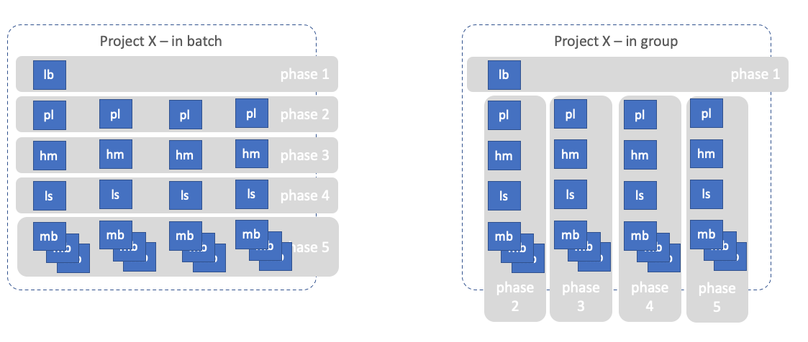

# Ansible Playbooks For Performance Test

Files in this folder is a way for creating lbaasv2 resources in batch. 

## Usage

### 1. Preparation

```
-> [Run once] $ ansible-playbook -i env-lab.ini -e@vars.yml create-projects-networks.yml
```

This command is used to create projects and networks(including subnets) before resource creation.

The count to be created is defined in vars-XX.yml file, like `projects: 200`

### 2. Resource Creation

#### Option 1
```
-> [Run repeatablely] $ ansible-playbook -i env-lab.ini -e@vars.yml create-resources-in-batch.yml -e index=<num>
```

This command is used to create resources under project `<num>` in batch.
The `<num>` is the project index.

Read ansible scripts in this folder for more details.

#### Option 2

```
-> [Run repeatablely] $ ansible-playbook -i env-lab.ini -e@vars.yml create-resources-in-group.yml -e index=<num>
```

This command is used to create resources under project `<num>` in group.


Differences between option 1 and option 2:


